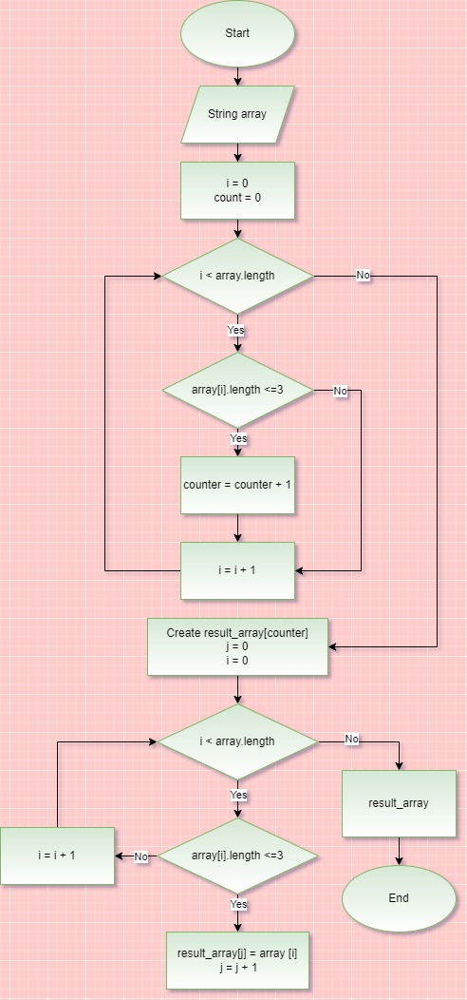

# GB_test
В данном репозитории расположения итоговая контрольная работа по основному блоку.
## Задание:
1. Создать репозиторий на GitHub
2. Нарисовать блок-схему алгоритма (можно обойтись блок-схемой основной содержательной части, если вы выделяете её в отдельный метод)
3. Снабдить репозиторий оформленным текстовым описанием решения (файл README.md)
4. Написать программу, решающую поставленную задачу
5. Использовать контроль версий в работе над этим небольшим проектом (не должно быть так, что всё залито одним коммитом, как минимум этапы 2, 3, и 4 должны быть расположены в разных коммитах)

***Задача: Написать программу, которая из имеющегося массива строк формирует новый массив из строк, длина которых меньше, либо равна 3 символам. Первоначальный массив можно ввести с клавиатуры, либо задать на старте выполнения алгоритма. При решении не рекомендуется пользоваться коллекциями, лучше обойтись исключительно массивами.***

*Примеры:*

*[“Hello”, “2”, “world”, “:-)”] → [“2”, “:-)”]*

*[“1234”, “1567”, “-2”, “computer science”] → [“-2”]*

*[“Russia”, “Denmark”, “Kazan”] → []*

# Решение:
## Для решения задания были созданы следующие функции: 
* ***Character_array*** - заполнение массива
* ***Print_array*** - печать массива
* ***Count_symbols*** -подсчет количества элементов
* ***Generate_new_array*** - создание нового массива

## Алгоритм решения: ##
* создаем массив;
* наполняем массив строками (консольный ввод);
* производим подсчета количества элементов массива, длина которых меньше либо равна 3 символа;
* создаем новый массив размером, равным количеству подсчитанных элементов;
* заполняем новый массив элементами, длина которых меньше либо равна 3 символа;
* выводим на печать оба массива для наглядности.

## Блок-схема алгоритма:

